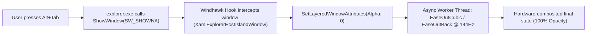

<div align="center">

  <h1>✨ Alt+Tab Smooth Animation for Windows 11</h1>
  
  <p align="center">
    <strong>Brings fluid, GPU-accelerated Fluent & macOS-style transition animations to the Windows 11 Task Switcher.</strong>
  </p>

  <p align="center">
    <a href="#-features">Features</a> •
    <a href="#-animation-styles">14 Styles</a> •
    <a href="#-how-it-works">Under the Hood</a> •
    <a href="#-installation">Installation</a> •
    <a href="#-configuration">Configuration</a> •
    <a href="#-license">License</a>
  </p>

  <!-- Badges -->
  <p align="center">
    <a href="https://windhawk.net/"></a>
    <a href="https://www.microsoft.com/windows"></a>
    <a href="https://opensource.org/licenses/MIT"></a>
    
    
  </p>

</div>

---

## 📽️ Preview

<!-- Replace with your actual GIF or mp4 recording from ScreenToGif -->
<div align="center">
  
  <p><em>Smooth Slide Up & Pop Animation in action on Windows 11</em></p>
</div>

---

## 💡 Why this mod?

In Windows 11, Microsoft redesigned the Alt+Tab switcher into a floating modern XAML flyout, but **completely disabled its open/close transitions** (`DWMWA_TRANSITIONS_FORCEDISABLED`). The switcher simply blinks into existence with 0ms visual pacing.

**Alt+Tab Smooth Animation** changes that. Built as a high-performance **[Windhawk](https://windhawk.net/)** mod, it injects directly into `explorer.exe` to intercept the display cycle and apply butter-smooth easing animations (60 / 120 / 144 / 240 Hz) with **absolute zero input lag**.

---

## 🚀 Features

- ⚡ **Zero Input Lag:** The mod intercepts appearance and does not delay window focus. When releasing `Alt`, focus transfers instantly to your chosen application.
- 🎨 **14 Handcrafted Animation Styles:** From delicate cubic fades to springy iOS-like pops and crisp mechanical slides.
- 🛡️ **Fail-Safe & Stable:** Hooks standard Win32 APIs (`ShowWindow`) without touching fragile binary memory offsets. 100% resilient across Windows 11 cumulative updates.
- 🔄 **Anti-Stutter Rapid Switching:** Repeatedly tapping `Alt+Tab` seamlessly and cleanly cancels previous frames without visual glitching or thread deadlocks.
- 🎛️ **Fully Customizable:** Adjust animation styles, duration (ms), travel distance (px), and scale percentage on the fly from the Windhawk settings UI.

---

## 🎭 14 Animation Styles

Choose your favorite look directly from the Windhawk settings dropdown:

| # | Style Name | Visual Category | Description |
| :-: | :--- | :---: | :--- |
| 1 | **`Fade + Slide Up`** ⭐ | `Fade + Motion` | **Recommended.** Glides gently upwards from below while fading in (matches native Win 11 flyouts). |
| 2 | **`Fade + Slide Down`** | `Fade + Motion` | Softly drops into place from above while fading in. |
| 3 | **`Fade + Slide from Right`** | `Fade + Motion` | Horizontal entrance, smoothly sliding in from the right edge. |
| 4 | **`Fade + Slide from Left`** | `Fade + Motion` | Horizontal entrance, smoothly sliding in from the left edge. |
| 5 | **`Fade + Zoom In`** | `Fade + Scale` | Expands smoothly outward from a compact center scale (~92% to 100%). |
| 6 | **`Fade + Zoom Out`** | `Fade + Scale` | Drops in from an oversized scale (108% down to 100%). |
| 7 | **`Pop & Overshoot`** 🔥 | `Spring Bounce` | Modern iOS/macOS spring effect: zooms to 103% then settles into place. |
| 8 | **`Bounce & Overshoot`** | `Spring Bounce` | Slides upwards with an energetic, playful elastic bounce. |
| 9 | **`Fade Only`** | `Pure Alpha` | Minimalist, clean opacity fade without spatial movement. |
| 10 | **`Solid Slide Up`** | `Solid (No Fade)` | Crisp mechanical slide up at 100% solid opacity (no transparency change). |
| 11 | **`Solid Slide Down`** | `Solid (No Fade)` | Crisp mechanical slide down at 100% solid opacity. |
| 12 | **`Solid Slide from Right`** | `Solid (No Fade)` | Crisp horizontal entrance from the right at full opacity. |
| 13 | **`Solid Slide from Left`** | `Solid (No Fade)` | Crisp horizontal entrance from the left at full opacity. |
| 14 | **`Solid Zoom In`** | `Solid (No Fade)` | Snappy physical zoom from center without opacity fading. |

---

## ⚙️ Configuration

Tweak your experience in the **Settings** tab of Windhawk:

```yaml
- animationStyle: slideUpFade    # Pick any of the 14 styles
- duration: 150                 # Duration in milliseconds (60 - 350 ms)
- slideDistance: 24             # Travel distance in pixels
- zoomScale: 92                 # Starting scale % for Zoom and Pop (70% - 98%)
```

<details>
<summary><strong>🔍 Recommended Presets (Click to expand)</strong></summary>

<br>

#### 🍎 macOS Style (Bouncy & Fluid)
- **Style:** `Pop & Overshoot`
- **Duration:** `170 ms`
- **Zoom Scale:** `90 %`

#### 🪟 Windows 11 Fluent Style (Subtle & Elegant)
- **Style:** `Fade + Slide Up`
- **Duration:** `140 ms`
- **Slide Distance:** `20 px`

#### ⚡ Gamer / Speed Preset (Ultra-Fast)
- **Style:** `Fade Only` or `Solid Slide Up`
- **Duration:** `90 ms`
- **Slide Distance:** `12 px`

</details>

---

## 🔬 Under The Hood (Architecture)



1. **Window Identification:** In Windows 11 (build 22000 through 26200+ 24H2), the switcher is rendered in `explorer.exe` as a modern XAML Island container (`XamlExplorerHostIslandWindow`).
2. **Hooking Point:** Instead of fragile binary pattern matching, the mod hooks the exported `user32.dll!ShowWindow`. When `SW_SHOWNA` (Cmd: 8) is dispatched, our hook takes over the presentation.
3. **Layered DWM Composition:** The window is temporarily assigned `WS_EX_LAYERED` attributes. Alpha adjustments and coordinate matrices are applied via non-blocking asynchronous threads.
4. **Easing Formula:**
   - **Cubic Deceleration:** $$f(t) = 1 - (1 - t)^3$$
   - **Elastic Overshoot (Back Ease-Out):** $$f(t) = 1 + c_3(t - 1)^3 + c_1(t - 1)^2$$
5. **Thread Safety:** Atomic generation counters (`g_animGen`) ensure that rapid double-tapping of `Alt+Tab` cancels obsolete worker loops immediately.

---

## 📦 Installation

### Option 1: Via Windhawk Catalog (Easiest)
1. Install **[Windhawk](https://windhawk.net/)** (if you haven't already).
2. Go to the **Explore** tab in the app.
3. Search for `Alt+Tab Smooth Animation`.
4. Click **Details** → **Install**.

### Option 2: Manual Installation
1. Open the **Windhawk** application.
2. Click the three dots (`...`) in the top-right corner → **New mod**.
3. Replace the template code with the contents of [`alt-tab-animation.wh.cpp`](./alt-tab-animation.wh.cpp).
4. Click **Compile Mod** (`Ctrl + F7`).
5. Press `Alt + Tab` to enjoy!

---

## 🤝 Contributing

Contributions, issues, and feature requests are always welcome!
Feel free to check the [issues page](https://github.com/ramensoftware/windhawk-mods/issues).

1. Fork the Project
2. Create your Feature Branch (`git checkout -b feature/AmazingAnimation`)
3. Commit your Changes (`git commit -m 'Add some AmazingAnimation'`)
4. Push to the Branch (`git push origin feature/AmazingAnimation`)
5. Open a Pull Request

---

## 📜 License

Distributed under the **MIT License**. See [`LICENSE`](https://opensource.org/licenses/MIT) for more information.

---

<div align="center">
  <sub>Crafted with ❤️ for the Windows customization community. If you like this mod, please consider giving it a ⭐!</sub>
</div>
